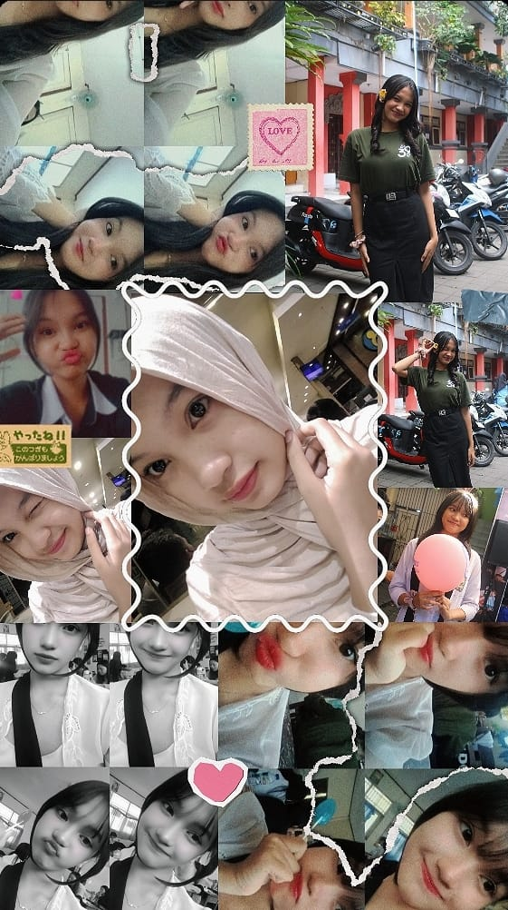
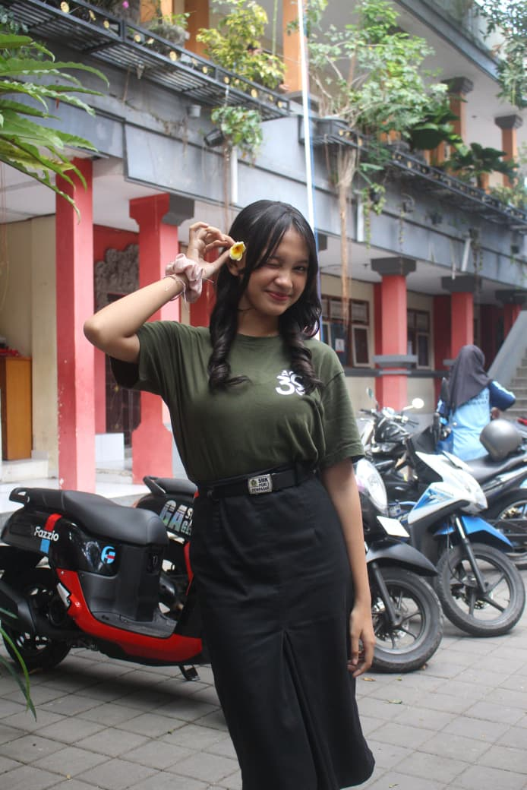
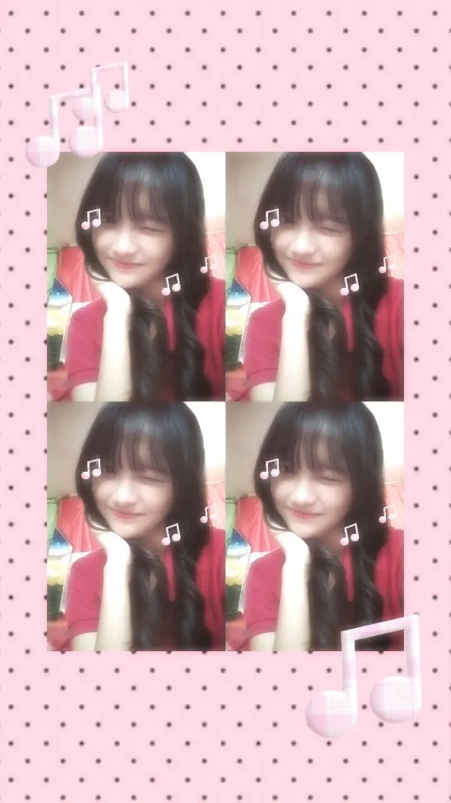
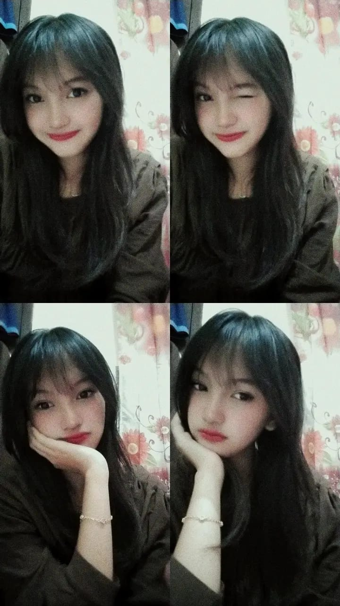
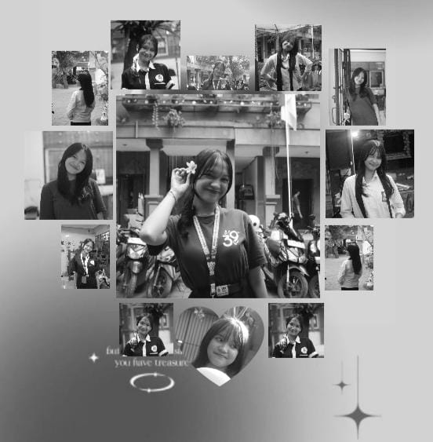
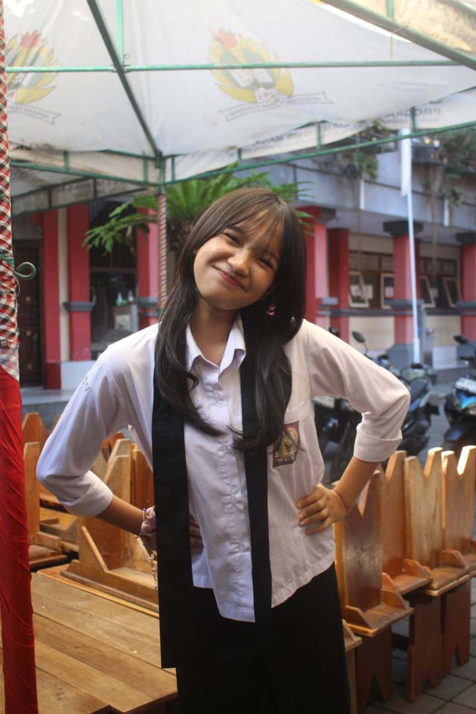
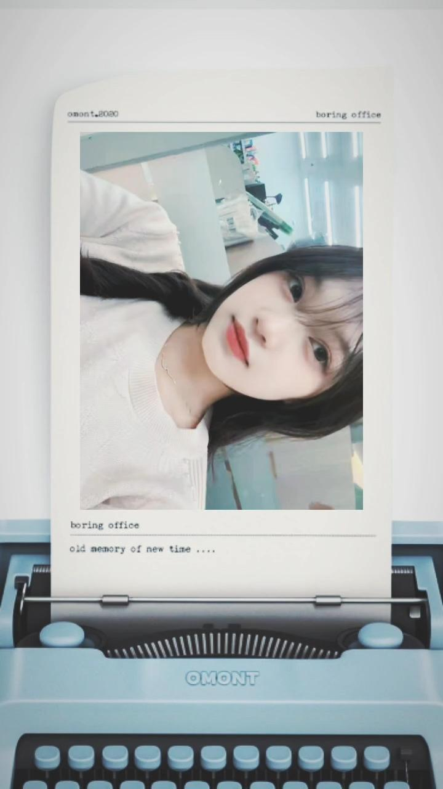
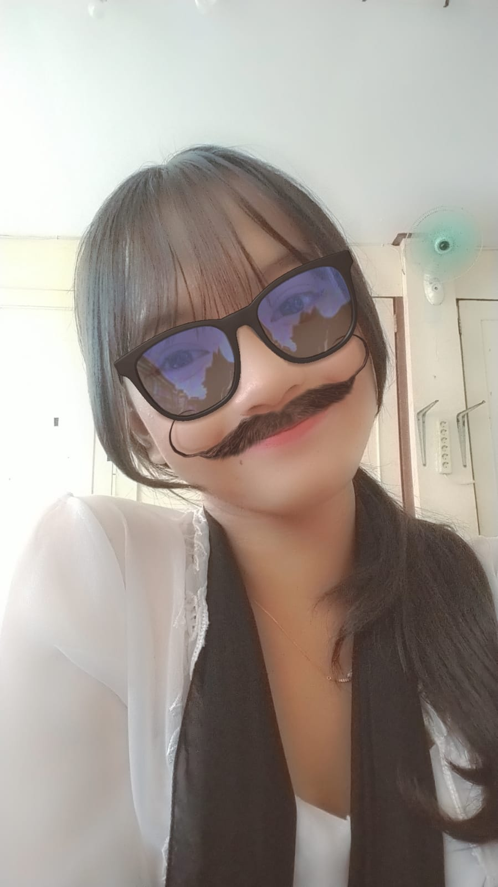

<!DOCTYPE html>
<html lang="id">
<head>
    <meta charset="UTF-8">
    <meta name="viewport" content="width=device-width, initial-scale=1.0">
    <title>Happy Birthday, Sayang! 💗</title>
    
    <link rel="preconnect" href="https://fonts.googleapis.com">
    <link rel="preconnect" href="https://fonts.gstatic.com" crossorigin>
    <link href="https://fonts.googleapis.com/css2?family=DM+Serif+Display&family=Dancing+Script:wght@600;700&family=Poppins:wght@300;400;500;600&display=swap" rel="stylesheet">
    
    <link rel="stylesheet" href="https://cdnjs.cloudflare.com/ajax/libs/font-awesome/6.4.0/css/all.min.css">
    
    <link rel="stylesheet" href="mylvv.css">
</head>
<body>

    

    

        

            <h2 class="script-font shimmer-text">Untuk seseorang yang sangat spesial... 💗</h2>
            <button id="start-btn" class="btn btn-primary glow-effect">
                <i class="fa-solid fa-envelope-open-text"></i> 💌 Buka Hadiah
            </button>
        

    

    <nav class="navbar" id="navbar">
        
For My Favorite Person 💕

        <ul class="nav-links">
            <li><a href="#hero" class="active">Home</a></li>
            <li><a href="#story">Our Story</a></li>
            <li><a href="#gallery">Gallery</a></li>
            <li><a href="#letter">Letter</a></li>
            <li><a href="#surprise">Surprise</a></li>
        </ul>
        

            <i class="fa-solid fa-bars"></i>
        

    </nav>

    <main id="main-content">

        <section id="hero" class="hero-section">
            

                

                    <h1 class="heading-font">Happy Birthday, Sayang! 💗</h1>
                    

                    <a href="#story" class="btn btn-secondary margin-top-2">Continue Our Story ↓</a>
                

                

                    

                        
                        
The Prettiest Smile ✨

                    

                

            

        </section>

        <section class="stats-section">
            

                

                    ∞
                    <h3>Love</h3>
                    
And Beyond

                

                

                    0
                    <h3>Days of Happiness</h3>
                    
Every single day with you

                

                

                    100%
                    <h3>My Favorite Person</h3>
                    
No doubt about it

                

            

        </section>

        <section id="story" class="story-section">
            <h2 class="section-title heading-font reveal">Our Little Story 💕</h2>
            

                

                    

                        15 Oktober 2023
                        <h3>First Meet</h3>
                        
                        
Senyuman yang tidak bisa ku lupakan

                    

                

                

                    

                        20 Oktober 2023
                        <h3>First Conversation</h3>
                        
                        
Ngobrol sampai lupa waktu. Dari topik random sampai kita sadar kalau kita nyambung banget.

                    

                

                

                    

                        14 Desember 2023
                        <h3>First Memory</h3>
                        
                        
Parasmu sangat cantik

                    

                

                

                    

                        Hari Ini
                        <h3>Today & Forever</h3>
                        
                        
Merayakan hari spesialmu. Semoga langkah kita ke depan selalu penuh rasa cinta yang sama.

                    

                

            

        </section>

        <section id="gallery" class="gallery-section">
            <h2 class="section-title heading-font reveal">Beautiful Memories 📸</h2>
            

                

                

                

                

                

                

            

        </section>

        

            &times;
            
        

        <section id="letter" class="letter-section">
            <h2 class="section-title heading-font reveal">A Letter For You 💌</h2>
            

                

                    

                    

                    

                        

                            <h3 class="script-font">Dear, Pacarku Tersayang...</h3>
                            
Seseorang yang selalu berhasil membuat hari-hariku menjadi jauh lebih indah dan penuh warna.

                            
Selamat ulang tahun ya! Terima kasih sudah hadir di hidupku, terima kasih atas semua tawa, kehangatan, dan kesabaran kamu selama ini.

                            
Semoga di usiamu yang baru ini, kamu selalu dilimpahi kebahagiaan, kesehatan, dan impian-impianmu perlahan terwujud. Aku akan selalu ada di sini untuk mendukungmu.

                            
With all my love ❤️

                        

                    

                    
<i class="fa-solid fa-heart"></i>

                

                
Klik amplop untuk membuka surat 💌

            

        </section>

        <section id="surprise" class="surprise-section">
            

                <h2 class="heading-font">Wait... There's One More Thing 💗</h2>
                
Aku punya satu kejutan kecil lagi untuk kamu!

                <button id="surprise-btn" class="btn btn-primary glow-effect margin-top-2">
                    <i class="fa-solid fa-gift"></i> Open Your Surprise 🎁
                </button>
            

        </section>

        

            

                &times;
                <h1 class="script-font main-surprise-title">Happy Birthday, My Favorite Person! 💗</h1>
                
Semoga hari ini menjadi awal dari banyak kebahagiaan, tawa, dan kenangan indah yang akan kita buat bersama.

                
✨🌸🎂🌸✨

            

        

        <footer class="final-section">
            

                <h2 class="script-font">Thank you for being part of my story. 💗</h2>
                
Happy Birthday, Sayang.

                With all my heart ♡
            

        </footer>

    </main>

    

        <audio id="bg-music" loop>
            <source src="lagu tenang.mp4" type="audio/mpeg">
            Browser kamu tidak mendukung audio element.
        </audio>
        

            <i class="fa-solid fa-music music-icon spinning"></i>
            

                Our Favorite Song
                

                    

                

            

        

        <button id="play-pause-btn" class="music-btn">
            <i class="fa-solid fa-play"></i>
        </button>
    

    <button id="back-to-top" class="back-to-top-btn"><i class="fa-solid fa-arrow-up"></i></button>

    <canvas id="confetti-canvas"></canvas>

    
</body>
</html>

/* ==========================================
   VARIABLES & DESIGN SYSTEM
   ========================================== */
:root {
    --bg-gradient: linear-gradient(135deg, #fff0f5 0%, #ffd1dc 50%, #f4acb7 100%);
    --soft-pink: #ffe5ec;
    --blush-pink: #ffb7c5;
    --rose-pink: #ff758f;
    --deep-pink: #c9184a;
    --accent-gold: #d4af37;
    --text-dark: #4a3e3d;
    --text-light: #ffffff;
    --glass-bg: rgba(255, 255, 255, 0.45);
    --glass-border: rgba(255, 255, 255, 0.6);
    --glass-shadow: 0 8px 32px 0 rgba(255, 182, 193, 0.37);
    --font-main: 'Poppins', sans-serif;
    --font-script: 'Dancing Script', cursive;
    --font-heading: 'DM Serif Display', serif;
    --transition-smooth: all 0.4s cubic-bezier(0.25, 1, 0.5, 1);
}

/* ==========================================
   BASE & RESET STYLES
   ========================================== */
* {
    margin: 0;
    padding: 0;
    box-sizing: border-box;
    scroll-behavior: smooth;
}

body {
    font-family: var(--font-main);
    background: var(--bg-gradient);
    color: var(--text-dark);
    overflow-x: hidden;
    min-height: 100vh;
}

/* Typography Utility */
.script-font { font-family: var(--font-script); }
.heading-font { font-family: var(--font-heading); }
.margin-top-2 { margin-top: 1.5rem; }

/* Canvas Confetti */
#confetti-canvas {
    position: fixed;
    top: 0;
    left: 0;
    width: 100vw;
    height: 100vh;
    pointer-events: none;
    z-index: 9999;
}

/* Floating Background Particles */
#particles-container {
    position: fixed;
    top: 0;
    left: 0;
    width: 100%;
    height: 100%;
    pointer-events: none;
    z-index: 0;
    overflow: hidden;
}

.floating-particle {
    position: absolute;
    bottom: -50px;
    opacity: 0.6;
    animation: floatUp linear infinite;
}

@keyframes floatUp {
    0% { transform: translateY(0) rotate(0deg); opacity: 0.8; }
    100% { transform: translateY(-110vh) rotate(360deg); opacity: 0; }
}

/* Glassmorphism Reusable Card */
.glass-card {
    background: var(--glass-bg);
    backdrop-filter: blur(12px);
    -webkit-backdrop-filter: blur(12px);
    border: 1px solid var(--glass-border);
    border-radius: 20px;
    box-shadow: var(--glass-shadow);
}

/* Buttons */
.btn {
    display: inline-block;
    padding: 12px 32px;
    border-radius: 50px;
    font-family: var(--font-main);
    font-weight: 500;
    text-decoration: none;
    border: none;
    cursor: pointer;
    transition: var(--transition-smooth);
}

.btn-primary {
    background: linear-gradient(45deg, var(--rose-pink), var(--deep-pink));
    color: var(--text-light);
    box-shadow: 0 4px 15px rgba(255, 117, 143, 0.4);
}

.btn-primary:hover {
    transform: translateY(-3deg) scale(1.03);
    box-shadow: 0 8px 25px rgba(255, 117, 143, 0.6);
}

.btn-secondary {
    background: rgba(255, 255, 255, 0.8);
    color: var(--deep-pink);
    border: 1px solid var(--rose-pink);
}

.btn-secondary:hover {
    background: var(--rose-pink);
    color: var(--text-light);
    transform: translateY(-3deg);
}

.glow-effect {
    animation: subtleGlow 2.5s infinite alternate;
}

@keyframes subtleGlow {
    0% { box-shadow: 0 0 10px rgba(255, 117, 143, 0.4); }
    100% { box-shadow: 0 0 25px rgba(255, 117, 143, 0.8), 0 0 10px var(--accent-gold); }
}

/* ==========================================
   1. OPENING SCREEN
   ========================================== */
.opening-screen {
    position: fixed;
    top: 0;
    left: 0;
    width: 100vw;
    height: 100vh;
    background: linear-gradient(135deg, #ffe5ec 0%, #ffb7c5 100%);
    display: flex;
    justify-content: center;
    align-items: center;
    z-index: 10000;
    transition: opacity 0.8s ease, visibility 0.8s ease;
    text-align: center;
}

.opening-screen.fade-out {
    opacity: 0;
    visibility: hidden;
}

.opening-content h2 {
    font-size: clamp(2rem, 5vw, 3.5rem);
    color: var(--deep-pink);
    margin-bottom: 2rem;
}

.shimmer-text {
    background: linear-gradient(90deg, var(--deep-pink), var(--accent-gold), var(--deep-pink));
    background-size: 200% auto;
    color: #000;
    -webkit-background-clip: text;
    -webkit-text-fill-color: transparent;
    animation: shimmer 3s linear infinite;
}

@keyframes shimmer {
    to { background-position: 200% center; }
}

/* ==========================================
   2. NAVBAR
   ========================================== */
.navbar {
    position: fixed;
    top: 0;
    left: 0;
    width: 100%;
    padding: 1rem 5%;
    display: flex;
    justify-content: space-between;
    align-items: center;
    background: rgba(255, 240, 245, 0.75);
    backdrop-filter: blur(10px);
    z-index: 1000;
    transition: var(--transition-smooth);
    border-bottom: 1px solid rgba(255, 255, 255, 0.3);
}

.nav-brand {
    font-size: 1.8rem;
    font-weight: bold;
    color: var(--deep-pink);
}

.nav-links {
    display: flex;
    list-style: none;
    gap: 2rem;
}

.nav-links a {
    text-decoration: none;
    color: var(--text-dark);
    font-weight: 500;
    transition: var(--transition-smooth);
    position: relative;
}

.nav-links a:hover,
.nav-links a.active {
    color: var(--deep-pink);
}

.nav-links a::after {
    content: '';
    position: absolute;
    bottom: -5px;
    left: 0;
    width: 0;
    height: 2px;
    background: var(--rose-pink);
    transition: var(--transition-smooth);
}

.nav-links a:hover::after,
.nav-links a.active::after {
    width: 100%;
}

.hamburger {
    display: none;
    font-size: 1.5rem;
    color: var(--deep-pink);
    cursor: pointer;
}

/* ==========================================
   3. HERO SECTION
   ========================================== */
.hero-section {
    min-height: 100vh;
    padding: 120px 8% 60px;
    display: flex;
    align-items: center;
}

.hero-container {
    display: grid;
    grid-template-columns: 1fr 1fr;
    gap: 3rem;
    align-items: center;
    width: 100%;
}

.hero-text h1 {
    font-size: clamp(2.5rem, 4vw, 4rem);
    color: var(--deep-pink);
    line-height: 1.2;
    margin-bottom: 1rem;
}

.hero-text .subtitle {
    font-size: 1.2rem;
    color: #665253;
    min-height: 3em;
}

.hero-image-wrapper {
    display: flex;
    justify-content: center;
}

.polaroid-frame {
    background: #fff;
    padding: 15px 15px 25px 15px;
    border-radius: 12px;
    box-shadow: 0 15px 35px rgba(244, 172, 183, 0.5);
    transform: rotate(-3deg);
    transition: var(--transition-smooth);
    max-width: 320px;
    width: 100%;
}

.polaroid-frame:hover {
    transform: rotate(0deg) scale(1.03);
}

.polaroid-frame img {
    width: 100%;
    height: 320px;
    object-fit: cover;
    border-radius: 8px;
}

.polaroid-caption {
    text-align: center;
    font-size: 1.5rem;
    color: var(--deep-pink);
    margin-top: 15px;
}

/* ==========================================
   4. STATS SECTION
   ========================================== */
.stats-section {
    padding: 60px 8%;
}

.stats-container {
    display: grid;
    grid-template-columns: repeat(auto-fit, minmax(220px, 1fr));
    gap: 2rem;
}

.stat-card {
    padding: 30px 20px;
    text-align: center;
    transition: var(--transition-smooth);
}

.stat-card:hover {
    transform: translateY(-10px);
}

.stat-icon, .stat-number {
    font-family: var(--font-heading);
    font-size: 3rem;
    color: var(--deep-pink);
    display: block;
}

.stat-card h3 {
    margin: 10px 0 5px;
    font-size: 1.2rem;
}

.stat-card p {
    font-size: 0.9rem;
    color: #7a6869;
}

/* ==========================================
   5. OUR STORY (TIMELINE)
   ========================================== */
.story-section {
    padding: 80px 8%;
}

.section-title {
    text-align: center;
    font-size: clamp(2rem, 3.5vw, 3rem);
    color: var(--deep-pink);
    margin-bottom: 3rem;
}

.timeline {
    position: relative;
    max-width: 900px;
    margin: 0 auto;
}

.timeline::after {
    content: '';
    position: absolute;
    width: 4px;
    background: var(--blush-pink);
    top: 0;
    bottom: 0;
    left: 50%;
    margin-left: -2px;
    border-radius: 2px;
}

.timeline-item {
    padding: 10px 40px;
    position: relative;
    width: 50%;
}

.timeline-item.left { left: 0; }
.timeline-item.right { left: 50%; }

.timeline-item::after {
    content: '💗';
    position: absolute;
    width: 30px;
    height: 30px;
    right: -15px;
    background: #fff;
    border: 2px solid var(--rose-pink);
    top: 15px;
    border-radius: 50%;
    z-index: 1;
    display: flex;
    align-items: center;
    justify-content: center;
    font-size: 0.8rem;
}

.timeline-item.right::after { left: -15px; }

.timeline-content {
    padding: 25px;
}

.timeline-content .date {
    font-weight: 600;
    color: var(--rose-pink);
    font-size: 0.85rem;
}

.timeline-content h3 {
    margin: 5px 0 10px;
    color: var(--deep-pink);
}

/* FOTO OUR LITTLE STORY (MENGIKUTI PROPORSI ASLI FOTO) */
.timeline-img {
    width: 100%;
    height: auto;
    object-fit: contain;
    border-radius: 12px;
    margin: 10px 0;
    display: block;
}

/* ==========================================
   6. PHOTO GALLERY
   ========================================== */
.gallery-section {
    padding: 80px 8%;
}

.gallery-grid {
    display: grid;
    grid-template-columns: repeat(auto-fill, minmax(260px, 1fr));
    gap: 1.5rem;
}

.gallery-item {
    overflow: hidden;
    border-radius: 16px;
    box-shadow: 0 8px 20px rgba(0,0,0,0.08);
    cursor: pointer;
    position: relative;
    transition: var(--transition-smooth);
    border: 3px solid transparent;
}

.gallery-item img {
    width: 100%;
    height: 280px;
    object-fit: cover;
    display: block;
    transition: var(--transition-smooth);
}

.gallery-item:hover {
    transform: rotate(1.5deg) scale(1.02);
    border-color: var(--rose-pink);
    box-shadow: 0 12px 25px rgba(255, 117, 143, 0.4);
}

.gallery-item:hover img {
    transform: scale(1.08);
}

/* Lightbox Modal */
.lightbox {
    display: none;
    position: fixed;
    z-index: 10001;
    top: 0;
    left: 0;
    width: 100%;
    height: 100%;
    background-color: rgba(0,0,0,0.85);
    backdrop-filter: blur(5px);
    justify-content: center;
    align-items: center;
}

.lightbox-content {
    max-width: 90%;
    max-height: 85vh;
    border-radius: 12px;
    box-shadow: 0 0 30px rgba(255,182,193,0.5);
    animation: zoomIn 0.3s ease;
}

.close-lightbox {
    position: absolute;
    top: 20px;
    right: 35px;
    color: #fff;
    font-size: 40px;
    font-weight: bold;
    cursor: pointer;
}

@keyframes zoomIn {
    from { transform: scale(0.7); opacity: 0; }
    to { transform: scale(1); opacity: 1; }
}

/* ==========================================
   7. SPECIAL LETTER
   ========================================== */
.letter-section {
    padding: 80px 8%;
    display: flex;
    flex-direction: column;
    align-items: center;
}

.envelope-wrapper {
    position: relative;
    margin-top: 3rem;
    cursor: pointer;
}

.envelope {
    position: relative;
    width: 320px;
    height: 220px;
    background: var(--blush-pink);
    border-bottom-left-radius: 10px;
    border-bottom-right-radius: 10px;
    box-shadow: 0 10px 30px rgba(0, 0, 0, 0.15);
    transition: var(--transition-smooth);
}

.front {
    position: absolute;
    width: 0;
    height: 0;
    z-index: 3;
}

.flap {
    border-left: 160px solid transparent;
    border-right: 160px solid transparent;
    border-top: 115px solid var(--rose-pink);
    transform-origin: top;
    transition: transform 0.4s ease 0.4s, z-index 0.2s;
    top: 0;
}

.pocket {
    border-left: 160px solid var(--soft-pink);
    border-right: 160px solid var(--soft-pink);
    border-bottom: 110px solid var(--blush-pink);
    border-radius: 0 0 10px 10px;
    bottom: 0;
}

.envelope-heart {
    position: absolute;
    top: 100px;
    left: 50%;
    transform: translate(-50%, -50%);
    color: var(--deep-pink);
    font-size: 2rem;
    z-index: 4;
    transition: var(--transition-smooth);
}

.letter {
    position: absolute;
    background: #fff;
    width: 90%;
    margin: 0 auto;
    height: 90%;
    top: 5%;
    left: 5%;
    border-radius: 8px;
    box-shadow: 0 2px 10px rgba(0,0,0,0.1);
    z-index: 2;
    transition: transform 0.4s ease, z-index 0.4s, height 0.4s;
    padding: 20px;
    overflow: hidden;
}

.letter-text {
    opacity: 0;
    transition: opacity 0.4s ease 0.4s;
    font-size: 0.9rem;
    line-height: 1.6;
}

.letter-text h3 { color: var(--deep-pink); margin-bottom: 10px; font-size: 1.5rem; }
.letter-text p { margin-bottom: 10px; }
.text-right { text-align: right; }

/* Envelope Open State */
.envelope.open .flap {
    transform: rotateX(180deg);
    z-index: 1;
}

.envelope.open .letter {
    position: fixed;
    top: 50%;
    left: 50%;
    transform: translate(-50%, -50%) !important;
    width: 90%;
    max-width: 550px;
    height: auto;
    max-height: 80vh;
    z-index: 10002;
    box-shadow: 0 0 40px rgba(0,0,0,0.3);
    overflow-y: auto;
    padding: 30px;
    background: #fff;
    border: 2px solid var(--blush-pink);
}

.envelope.open .letter-text {
    opacity: 1;
}

.envelope.open .envelope-heart {
    opacity: 0;
}

.click-hint {
    margin-top: 1.5rem;
    font-size: 0.9rem;
    color: #7a6869;
    text-align: center;
}

/* ==========================================
   9. SURPRISE SECTION
   ========================================== */
.surprise-section {
    padding: 80px 8%;
    text-align: center;
}

.surprise-container {
    padding: 50px 20px;
    max-width: 700px;
    margin: 0 auto;
}

.surprise-modal {
    display: none;
    position: fixed;
    top: 0;
    left: 0;
    width: 100vw;
    height: 100vh;
    background: rgba(255, 182, 193, 0.85);
    backdrop-filter: blur(10px);
    z-index: 10005;
    justify-content: center;
    align-items: center;
    padding: 20px;
}

.surprise-modal-content {
    max-width: 600px;
    padding: 40px 30px;
    text-align: center;
    position: relative;
    animation: popUp 0.5s cubic-bezier(0.175, 0.885, 0.32, 1.275);
}

.close-surprise {
    position: absolute;
    top: 15px;
    right: 20px;
    font-size: 28px;
    cursor: pointer;
    color: var(--deep-pink);
}

.main-surprise-title {
    font-size: clamp(2rem, 4vw, 3rem);
    color: var(--deep-pink);
    margin-bottom: 1.5rem;
}

.surprise-text {
    font-size: 1.1rem;
    line-height: 1.6;
    color: var(--text-dark);
}

.sparkle-icon {
    font-size: 2rem;
    margin-top: 20px;
}

@keyframes popUp {
    0% { transform: scale(0.5); opacity: 0; }
    100% { transform: scale(1); opacity: 1; }
}

/* ==========================================
   10. FINAL SECTION
   ========================================== */
.final-section {
    padding: 100px 8% 140px;
    text-align: center;
    background: rgba(255, 255, 255, 0.2);
}

.final-content h2 {
    font-size: clamp(2rem, 4vw, 3.5rem);
    color: var(--deep-pink);
    margin-bottom: 10px;
}

.final-content p {
    font-size: 1.8rem;
    color: var(--text-dark);
}

.heart-footer {
    display: block;
    margin-top: 20px;
    font-size: 1.2rem;
    color: var(--rose-pink);
}

/* ==========================================
   8. MUSIC PLAYER
   ========================================== */
.music-player {
    position: fixed;
    bottom: 25px;
    right: 25px;
    padding: 10px 18px;
    display: flex;
    align-items: center;
    gap: 12px;
    z-index: 999;
    border-radius: 50px;
}

.music-icon {
    font-size: 1.2rem;
    color: var(--deep-pink);
}

.spinning {
    animation: spin 4s linear infinite;
    animation-play-state: paused;
}

.spinning.active {
    animation-play-state: running;
}

@keyframes spin {
    100% { transform: rotate(360deg); }
}

.track-details {
    display: flex;
    flex-direction: column;
    width: 110px;
}

.track-title {
    font-size: 0.75rem;
    font-weight: 600;
    white-space: nowrap;
    overflow: hidden;
    text-overflow: ellipsis;
}

.progress-bar-container {
    width: 100%;
    height: 4px;
    background: rgba(0,0,0,0.1);
    border-radius: 2px;
    margin-top: 4px;
    cursor: pointer;
}

.progress-bar {
    width: 0%;
    height: 100%;
    background: var(--rose-pink);
    border-radius: 2px;
}

.music-btn {
    background: var(--rose-pink);
    border: none;
    width: 32px;
    height: 32px;
    border-radius: 50%;
    color: #fff;
    cursor: pointer;
    display: flex;
    align-items: center;
    justify-content: center;
    font-size: 0.8rem;
    transition: var(--transition-smooth);
}

.music-btn:hover {
    background: var(--deep-pink);
}

/* Back to Top Button */
.back-to-top-btn {
    position: fixed;
    bottom: 25px;
    left: 25px;
    width: 40px;
    height: 40px;
    border-radius: 50%;
    background: var(--glass-bg);
    border: 1px solid var(--glass-border);
    color: var(--deep-pink);
    cursor: pointer;
    display: none;
    align-items: center;
    justify-content: center;
    z-index: 999;
    transition: var(--transition-smooth);
}

.back-to-top-btn:hover {
    background: var(--rose-pink);
    color: #fff;
}

/* ==========================================
   SCROLL REVEAL ANIMATION CLASS
   ========================================== */
.reveal {
    opacity: 0;
    transform: translateY(30px);
    transition: opacity 0.8s ease, transform 0.8s ease;
}

.reveal.active {
    opacity: 1;
    transform: translateY(0);
}

/* ==========================================
   RESPONSIVE DESIGN (MOBILE & TABLET)
   ========================================== */
@media (max-width: 768px) {
    .nav-links {
        position: fixed;
        top: 60px;
        right: -100%;
        width: 70%;
        height: calc(100vh - 60px);
        background: rgba(255, 240, 245, 0.95);
        backdrop-filter: blur(15px);
        flex-direction: column;
        align-items: center;
        justify-content: center;
        transition: var(--transition-smooth);
    }

    .nav-links.nav-active { right: 0; }
    .hamburger { display: block; }

    .hero-container {
        grid-template-columns: 1fr;
        text-align: center;
    }

    .hero-image-wrapper { margin-top: 2rem; }

    .timeline::after { left: 31px; }
    .timeline-item {
        width: 100%;
        padding-left: 70px;
        padding-right: 25px;
    }
    .timeline-item.right { left: 0%; }
    .timeline-item.left::after,
    .timeline-item.right::after {
        left: 15px;
    }

    .envelope.open .letter {
        width: 95%;
        padding: 20px;
    }
}

document.addEventListener('DOMContentLoaded', () => {

    /* ==========================================
       1. FLOATING HEARTS & SPARKLES GENERATOR
       ========================================== */
    const particlesContainer = document.getElementById('particles-container');
    const particleTypes = ['💗', '💖', '✨', '🌸', '💕'];

    function createParticle() {
        if (!particlesContainer) return;
        const particle = document.createElement('div');
        particle.classList.add('floating-particle');
        particle.innerText = particleTypes[Math.floor(Math.random() * particleTypes.length)];
        
        const size = Math.random() * 15 + 10;
        const left = Math.random() * 100;
        const duration = Math.random() * 6 + 6;

        particle.style.left = `${left}vw`;
        particle.style.fontSize = `${size}px`;
        particle.style.animationDuration = `${duration}s`;

        particlesContainer.appendChild(particle);

        setTimeout(() => {
            particle.remove();
        }, duration * 1000);
    }

    setInterval(createParticle, 400);

    /* ==========================================
       2. OPENING SCREEN & MUSIC AUTO-PLAY INTERACTION
       ========================================== */
    const startBtn = document.getElementById('start-btn');
    const openingScreen = document.getElementById('opening-screen');
    const bgMusic = document.getElementById('bg-music');
    const playPauseBtn = document.getElementById('play-pause-btn');
    const musicIcon = document.querySelector('.music-icon');

    startBtn.addEventListener('click', () => {
        openingScreen.classList.add('fade-out');
        
        // Memulai musik setelah interaksi user
        if (bgMusic) {
            bgMusic.play().then(() => {
                updateMusicUI(true);
            }).catch(() => {
                updateMusicUI(false);
            });
        }

        // Jalankan Typing Effect Hero saat halaman dibuka
        startTypingEffect();
    });

    function updateMusicUI(isPlaying) {
        if (!playPauseBtn || !musicIcon) return;
        if (isPlaying) {
            playPauseBtn.innerHTML = '<i class="fa-solid fa-pause"></i>';
            musicIcon.classList.add('active');
        } else {
            playPauseBtn.innerHTML = '<i class="fa-solid fa-play"></i>';
            musicIcon.classList.remove('active');
        }
    }

    /* ==========================================
       3. MUSIC PLAYER CONTROLS
       ========================================== */
    if (playPauseBtn && bgMusic) {
        playPauseBtn.addEventListener('click', () => {
            if (bgMusic.paused) {
                bgMusic.play();
                updateMusicUI(true);
            } else {
                bgMusic.pause();
                updateMusicUI(false);
            }
        });

        // Progress Bar
        const progressBar = document.getElementById('progress-bar');
        const progressContainer = document.getElementById('progress-container');

        bgMusic.addEventListener('timeupdate', () => {
            if (bgMusic.duration) {
                const progressPercent = (bgMusic.currentTime / bgMusic.duration) * 100;
                progressBar.style.width = `${progressPercent}%`;
            }
        });

        progressContainer.addEventListener('click', (e) => {
            const width = progressContainer.clientWidth;
            const clickX = e.offsetX;
            const duration = bgMusic.duration;
            bgMusic.currentTime = (clickX / width) * duration;
        });
    }

    /* ==========================================
       4. HERO TYPING EFFECT
       ========================================== */
    const typingElement = document.getElementById('typing-hero');
    const textToType = "Today is all about the most beautiful person in my world.";
    let typeIndex = 0;

    function startTypingEffect() {
        if (!typingElement) return;
        if (typeIndex < textToType.length) {
            typingElement.innerHTML += textToType.charAt(typeIndex);
            typeIndex++;
            setTimeout(startTypingEffect, 60);
        }
    }

    /* ==========================================
       5. NAVBAR MOBILE TOGGLE & SMOOTH SCROLLING
       ========================================== */
    const hamburger = document.querySelector('.hamburger');
    const navLinks = document.querySelector('.nav-links');
    const navItems = document.querySelectorAll('.nav-links a');

    if (hamburger) {
        hamburger.addEventListener('click', () => {
            navLinks.classList.toggle('nav-active');
        });
    }

    navItems.forEach(item => {
        item.addEventListener('click', () => {
            if (navLinks.classList.contains('nav-active')) {
                navLinks.classList.remove('nav-active');
            }
        });
    });

    // Active Navbar Link Indicator on Scroll
    const sections = document.querySelectorAll('section');
    window.addEventListener('scroll', () => {
        let current = '';
        sections.forEach(section => {
            const sectionTop = section.offsetTop - 150;
            if (pageYOffset >= sectionTop) {
                current = section.getAttribute('id');
            }
        });

        navItems.forEach(a => {
            a.classList.remove('active');
            if (a.getAttribute('href') === `#${current}`) {
                a.classList.add('active');
            }
        });

        // Back to Top Visibility
        const backToTopBtn = document.getElementById('back-to-top');
        if (backToTopBtn) {
            if (window.scrollY > 400) {
                backToTopBtn.style.display = 'flex';
            } else {
                backToTopBtn.style.display = 'none';
            }
        }
    });

    // Back to Top Click
    const backToTopBtn = document.getElementById('back-to-top');
    if (backToTopBtn) {
        backToTopBtn.addEventListener('click', () => {
            window.scrollTo({ top: 0, behavior: 'smooth' });
        });
    }

    /* ==========================================
       6. SCROLL REVEAL ANIMATION (INTERSECTION OBSERVER)
       ========================================== */
    const reveals = document.querySelectorAll('.reveal');
    const observer = new IntersectionObserver((entries) => {
        entries.forEach(entry => {
            if (entry.isIntersecting) {
                entry.target.classList.add('active');
                
                // Trigger Counter Animation if card is visible
                if (entry.target.contains(document.querySelector('.stat-number'))) {
                    startCounters();
                }
            }
        });
    }, { threshold: 0.15 });

    reveals.forEach(reveal => observer.observe(reveal));

    /* ==========================================
       7. STATS COUNTER ANIMATION
       ========================================== */
    let counted = false;
    function startCounters() {
        if (counted) return;
        const counters = document.querySelectorAll('.stat-number');
        counters.forEach(counter => {
            const target = +counter.getAttribute('data-target');
            let count = 0;
            const speed = target / 50;

            const updateCount = () => {
                count += speed;
                if (count < target) {
                    counter.innerText = Math.ceil(count);
                    setTimeout(updateCount, 30);
                } else {
                    counter.innerText = target;
                }
            };
            updateCount();
        });
        counted = true;
    }

    /* ==========================================
       8. PHOTO GALLERY LIGHTBOX
       ========================================== */
    const galleryItems = document.querySelectorAll('.gallery-item img');
    const lightbox = document.getElementById('lightbox');
    const lightboxImg = document.getElementById('lightbox-img');
    const closeLightbox = document.querySelector('.close-lightbox');

    galleryItems.forEach(img => {
        img.addEventListener('click', () => {
            lightbox.style.display = 'flex';
            lightboxImg.src = img.src;
        });
    });

    if (closeLightbox) {
        closeLightbox.addEventListener('click', () => {
            lightbox.style.display = 'none';
        });
    }

    if (lightbox) {
        lightbox.addEventListener('click', (e) => {
            if (e.target !== lightboxImg) {
                lightbox.style.display = 'none';
            }
        });
    }

    /* ==========================================
       9. SPECIAL ENVELOPE INTERACTION
       ========================================== */
    const envelope = document.getElementById('envelope');
    if (envelope) {
        envelope.addEventListener('click', (e) => {
            envelope.classList.toggle('open');
            e.stopPropagation();
        });

        // Close letter when clicking outside
        document.addEventListener('click', (e) => {
            if (envelope.classList.contains('open') && !envelope.contains(e.target)) {
                envelope.classList.remove('open');
            }
        });
    }

    /* ==========================================
       10. SURPRISE MODAL & CONFETTI EFEK
       ========================================== */
    const surpriseBtn = document.getElementById('surprise-btn');
    const surpriseModal = document.getElementById('surprise-modal');
    const closeSurprise = document.querySelector('.close-surprise');

    if (surpriseBtn && surpriseModal) {
        surpriseBtn.addEventListener('click', () => {
            surpriseModal.style.display = 'flex';
            launchHeartConfetti();
        });
    }

    if (closeSurprise) {
        closeSurprise.addEventListener('click', () => {
            surpriseModal.style.display = 'none';
        });
    }

    /* Custom Canvas Heart Confetti Engine */
    const canvas = document.getElementById('confetti-canvas');
    const ctx = canvas ? canvas.getContext('2d') : null;
    let particles = [];

    function resizeCanvas() {
        if (!canvas) return;
        canvas.width = window.innerWidth;
        canvas.height = window.innerHeight;
    }
    window.addEventListener('resize', resizeCanvas);
    resizeCanvas();

    function launchHeartConfetti() {
        if (!canvas || !ctx) return;
        particles = [];
        for (let i = 0; i < 80; i++) {
            particles.push({
                x: canvas.width / 2,
                y: canvas.height / 2,
                size: Math.random() * 12 + 8,
                color: ['#ff758f', '#ffb7c5', '#c9184a', '#d4af37', '#ffffff'][Math.floor(Math.random() * 5)],
                vx: (Math.random() - 0.5) * 12,
                vy: (Math.random() - 0.5) * 12 - 4,
                rot: Math.random() * 360,
                opacity: 1
            });
        }
        animateConfetti();
    }

    function drawHeart(x, y, size, color, opacity, rot) {
        ctx.save();
        ctx.translate(x, y);
        ctx.rotate((rot * Math.PI) / 180);
        ctx.globalAlpha = opacity;
        ctx.fillStyle = color;
        ctx.beginPath();
        const topCurveHeight = size * 0.3;
        ctx.moveTo(0, topCurveHeight);
        ctx.bezierCurveTo(0, 0, -size / 2, 0, -size / 2, topCurveHeight);
        ctx.bezierCurveTo(-size / 2, (size + topCurveHeight) / 2, 0, size, 0, size);
        ctx.bezierCurveTo(0, size, size / 2, (size + topCurveHeight) / 2, size / 2, topCurveHeight);
        ctx.bezierCurveTo(size / 2, 0, 0, 0, 0, topCurveHeight);
        ctx.closePath();
        ctx.fill();
        ctx.restore();
    }

    let animationFrameId;
    function animateConfetti() {
        ctx.clearRect(0, 0, canvas.width, canvas.height);
        let activeParticles = 0;

        particles.forEach(p => {
            p.x += p.vx;
            p.y += p.vy;
            p.vy += 0.15; // Gravity
            p.opacity -= 0.008;
            p.rot += 2;

            if (p.opacity > 0) {
                activeParticles++;
                drawHeart(p.x, p.y, p.size, p.color, p.opacity, p.rot);
            }
        });

        if (activeParticles > 0) {
            animationFrameId = requestAnimationFrame(animateConfetti);
        } else {
            cancelAnimationFrame(animationFrameId);
            ctx.clearRect(0, 0, canvas.width, canvas.height);
        }
    }
});
